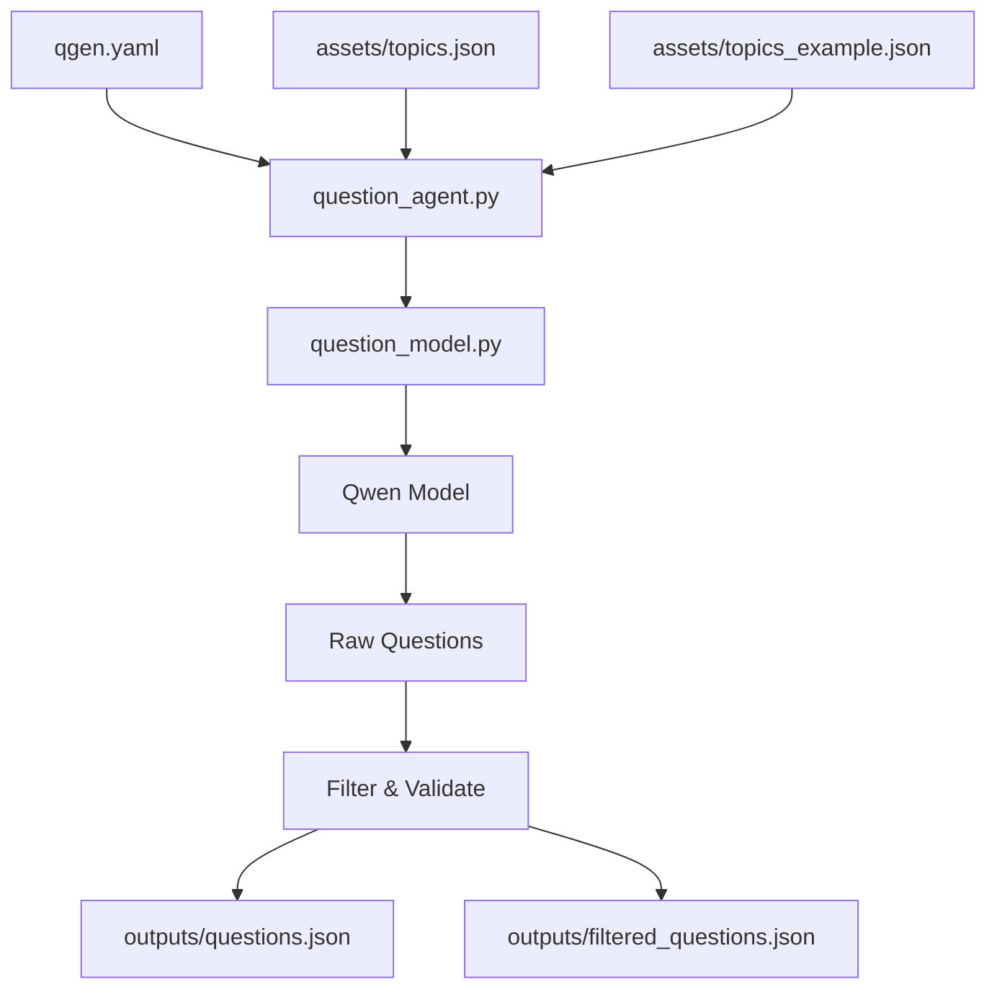
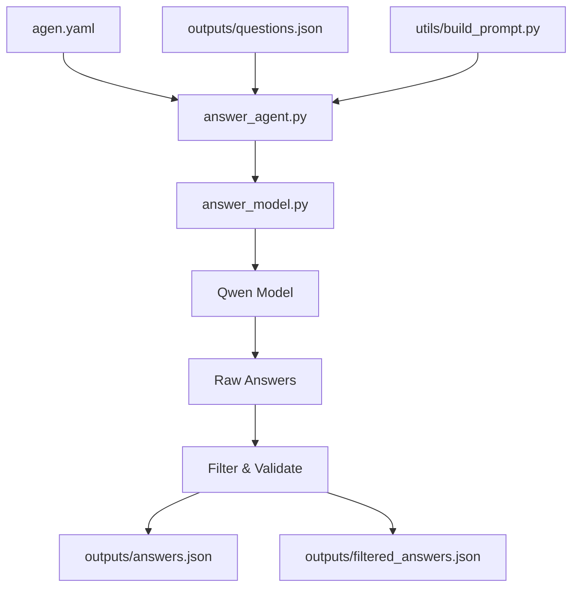
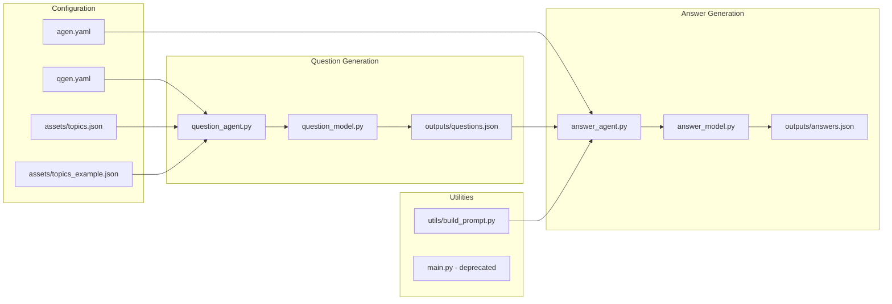

# Ultimate Codebase Mapping & File Relationships

This document provides a comprehensive visual and textual mapping of how all files and folders in the hackathon project are connected, influenced by, and depend on each other.

---

## 🗂️ Project Structure Overview

```
AAIPL_134_199_204_100/
├── 📁 agents/                    # Core AI agent implementations
│   ├── question_agent.py         # High-level question generation
│   ├── question_model.py         # Low-level question model wrapper
│   ├── answer_agent.py           # High-level answer solving
│   ├── answer_model.py           # Low-level answer model wrapper
│   └── README.md                 # Agent documentation
├── 📁 assets/                    # Data and configuration assets
│   ├── topics.json               # Topic definitions for questions
│   ├── topics_example.json       # Example questions for ICL
│   ├── sample_question.json      # Sample question format
│   ├── sample_answer.json        # Sample answer format
│   └── *.png, *.jpg             # Image assets
├── 📁 utils/                     # Utility functions
│   └── build_prompt.py           # Prompt building utilities
├── 📁 tutorial/                  # Training and demo materials
│   ├── trainer.py                # Model training script
│   ├── tutorial.ipynb            # Jupyter tutorial
│   ├── checkpoints/              # Model checkpoints
│   └── *.json                   # Test data files
├── 📁 outputs/                   # Generated outputs (runtime)
├── 📁 ckpt/                      # Checkpoint storage
├── ⚙️ agen.yaml                  # Answer agent configuration
├── ⚙️ qgen.yaml                  # Question agent configuration
├── 📄 main.py                    # Unified CLI (deprecated)
├── 📄 aq-gen-yaml.md            # YAML config documentation
├── 📄 ultimate_mapping.md        # This file
├── 📄 README.ipynb              # Project overview notebook
└── 📄 default_requirements.txt   # Python dependencies
```

---

## 🔗 File Relationship Matrix

### Core Dependencies

| File | Depends On | Influences | Purpose |
|------|------------|------------|---------|
| `agents/question_agent.py` | `question_model.py`, `qgen.yaml`, `assets/topics.json`, `assets/topics_example.json` | `outputs/questions.json`, `outputs/filtered_questions.json` | Orchestrates question generation |
| `agents/answer_agent.py` | `answer_model.py`, `agen.yaml`, `utils/build_prompt.py` | `outputs/answers.json`, `outputs/filtered_answers.json` | Orchestrates answer solving |
| `agents/question_model.py` | Qwen model (external) | `question_agent.py` | Direct model interface for questions |
| `agents/answer_model.py` | Qwen model (external) | `answer_agent.py` | Direct model interface for answers |

### Configuration Dependencies

| Config File | Used By | Controls | Impact |
|-------------|---------|----------|--------|
| `qgen.yaml` | `agents/question_agent.py` | Generation parameters (temp=0.7, tokens=1024) | Question creativity and length |
| `agen.yaml` | `agents/answer_agent.py` | Generation parameters (temp=0.1, tokens=512) | Answer accuracy and conciseness |
| `assets/topics.json` | `agents/question_agent.py` | Available question topics | Topic selection for generation |
| `assets/topics_example.json` | `agents/question_agent.py` | In-context learning examples | Question format and quality |

---

## 🔄 Data Flow Diagrams

### Question Generation Pipeline



### Answer Generation Pipeline



### Complete Workflow



---

## 📊 Detailed File Relationships

### 1. **Question Generation Ecosystem**

#### `agents/question_agent.py` (Orchestrator)
**Dependencies:**
- `agents/question_model.py` - Core model wrapper
- `qgen.yaml` - Generation parameters
- `assets/topics.json` - Topic definitions
- `assets/topics_example.json` - ICL examples

**Influences:**
- `outputs/questions.json` - Raw generated questions
- `outputs/filtered_questions.json` - Quality-filtered questions

**Key Relationships:**
```python
# Loads configuration
with open("qgen.yaml", "r") as f: 
    gen_kwargs.update(yaml.safe_load(f))

# Loads topics
with open("assets/topics.json") as f: 
    topics = json.load(f)

# Uses ICL examples
inc_samples = QuestioningAgent.load_icl_samples("assets/topics_example.json")

# Creates model instance
self.agent = QAgent()  # from question_model.py
```

#### `agents/question_model.py` (Core Engine)
**Dependencies:**
- Qwen model (external HuggingFace)
- transformers library

**Influences:**
- `agents/question_agent.py` - Provides generation capability

**Key Relationships:**
```python
# Model loading (hardcoded path - needs fixing)
model_name = "/jupyter-tutorial/hf_models/Qwen3-4B"
self.tokenizer = AutoTokenizer.from_pretrained(model_name)
self.model = AutoModelForCausalLM.from_pretrained(model_name)
```

### 2. **Answer Generation Ecosystem**

#### `agents/answer_agent.py` (Orchestrator)
**Dependencies:**
- `agents/answer_model.py` - Core model wrapper
- `agen.yaml` - Generation parameters
- `utils/build_prompt.py` - Prompt utilities
- Question files from question generation

**Influences:**
- `outputs/answers.json` - Raw generated answers
- `outputs/filtered_answers.json` - Quality-filtered answers

**Key Relationships:**
```python
# Loads configuration
with open("agen.yaml", "r") as f: 
    gen_kwargs.update(yaml.safe_load(f))

# Loads questions to solve
with open(args.input_file, 'r') as f:
    sample_questions = json.load(f)

# Uses utilities
from utils.build_prompt import auto_json, option_extractor_prompt

# Creates model instance
self.agent = AAgent()  # from answer_model.py
```

#### `agents/answer_model.py` (Core Engine)
**Dependencies:**
- Qwen model (external HuggingFace)
- transformers library

**Influences:**
- `agents/answer_agent.py` - Provides solving capability

**Key Relationships:**
```python
# Model loading (same hardcoded path issue)
model_name = "/jupyter-tutorial/hf_models/Qwen3-4B"
self.tokenizer = AutoTokenizer.from_pretrained(model_name)
self.model = AutoModelForCausalLM.from_pretrained(model_name)
```

### 3. **Configuration Ecosystem**

#### YAML Configuration Files
```yaml
# qgen.yaml - Question Generation Config
max_new_tokens: 1024    # Longer for complex questions
temperature: 0.7        # Higher creativity
top_p: 0.9
repetition_penalty: 1.2
do_sample: true

# agen.yaml - Answer Generation Config  
max_new_tokens: 512     # Shorter for concise answers
temperature: 0.1        # Lower for accuracy
top_p: 0.9
repetition_penalty: 1.2
do_sample: true
```

**Impact Flow:**
```
YAML Files → Agent Scripts → Model Parameters → Generation Behavior
```

### 4. **Asset Dependencies**

#### `assets/topics.json`
**Structure:**
```json
{
  "Number Series": ["arithmetic", "geometric", "fibonacci"],
  "Logical Reasoning": ["syllogism", "coding-decoding"],
  // ... more topics
}
```

**Used By:** `question_agent.py` for topic selection

#### `assets/topics_example.json`
**Structure:**
```json
{
  "Number Series": [
    {
      "question": "Find next: 2, 4, 8, 16, ?",
      "choices": ["A) 24", "B) 32", "C) 28", "D) 30"],
      "answer": "B",
      "explanation": "Powers of 2 sequence"
    }
  ]
}
```

**Used By:** `question_agent.py` for in-context learning

### 5. **Utility Dependencies**

#### `utils/build_prompt.py`
**Functions:**
- `auto_json()` - JSON extraction utilities
- `option_extractor_prompt()` - Answer extraction

**Used By:** `answer_agent.py` for response processing

### 6. **Output Dependencies**

#### Runtime Generated Files
```
outputs/
├── questions.json          # Raw questions from question_agent.py
├── filtered_questions.json # Filtered questions from question_agent.py
├── answers.json           # Raw answers from answer_agent.py
└── filtered_answers.json  # Filtered answers from answer_agent.py
```

**Flow:**
```
question_agent.py → outputs/questions.json → answer_agent.py → outputs/answers.json
```

---

## 🔧 Critical Dependencies & Issues

### Model Loading Dependencies
**Issue:** Both model files use hardcoded paths
```python
# In question_model.py and answer_model.py
model_name = "/jupyter-tutorial/hf_models/Qwen3-4B"  # ❌ Path doesn't exist
```

**Impact:** Prevents agents from running without manual path fixes

**Solution:** Update to HuggingFace Hub paths:
```python
model_name = "Qwen/Qwen2.5-3B-Instruct"  # ✅ Valid repo
```

### Asset Dependencies
**Required for question generation:**
- `assets/topics.json` - Must exist and be valid JSON
- `assets/topics_example.json` - Optional but improves quality

**Required for answer generation:**
- Question files (from question generation or manual)
- `utils/build_prompt.py` - For response processing

### Configuration Dependencies
**YAML files must be valid and present:**
- `qgen.yaml` - Required by question_agent.py
- `agen.yaml` - Required by answer_agent.py

**Missing files cause runtime errors**

---

## 🚀 Execution Flow Patterns

### Standalone Question Generation
```bash
python -m agents.question_agent --num_questions 20 --output_file outputs/questions.json
```

**File Access Pattern:**
1. Load `qgen.yaml` → generation parameters
2. Load `assets/topics.json` → topic selection
3. Load `assets/topics_example.json` → ICL examples
4. Initialize `question_model.py` → model access
5. Generate → `outputs/questions.json` & `outputs/filtered_questions.json`

### Standalone Answer Generation
```bash
python -m agents.answer_agent --input_file outputs/questions.json --output_file outputs/answers.json
```

**File Access Pattern:**
1. Load `agen.yaml` → generation parameters
2. Load input questions → question data
3. Import `utils/build_prompt.py` → utilities
4. Initialize `answer_model.py` → model access
5. Generate → `outputs/answers.json` & `outputs/filtered_answers.json`

### Complete Pipeline
```bash
# Step 1: Generate questions
python -m agents.question_agent --num_questions 50 --output_file outputs/q.json

# Step 2: Solve questions  
python -m agents.answer_agent --input_file outputs/q.json --output_file outputs/a.json
```

**Cross-file Dependencies:**
```
qgen.yaml + assets/* → question_agent.py → outputs/q.json
                                              ↓
agen.yaml + utils/* ← answer_agent.py ← outputs/q.json → outputs/a.json
```

---

## 🔍 Dependency Analysis

### High Coupling Areas
1. **Agent ↔ Model**: Each agent tightly coupled to its model wrapper
2. **Agent ↔ YAML**: Agents require specific YAML files
3. **Question → Answer**: Answer generation depends on question format

### Low Coupling Areas
1. **Question ↔ Answer**: Can run independently
2. **Assets**: Modular and replaceable
3. **Utilities**: Optional enhancements

### Critical Path Dependencies
```
Model Files → Model Wrappers → Agent Scripts → YAML Configs → Outputs
     ↑              ↑              ↑              ↑
  REQUIRED      REQUIRED       REQUIRED       REQUIRED
```

### Optional Dependencies
```
Assets (topics, examples) → Enhanced Quality
Utils (build_prompt) → Better Processing
Tutorial/* → Training & Development
```

---

## 📈 Impact Analysis

### Changing YAML Files
**Impact:** Generation behavior only
**Affected:** Agent scripts during runtime
**Scope:** Parameter-level changes

### Changing Asset Files
**Impact:** Question content and quality
**Affected:** Question generation pipeline
**Scope:** Content-level changes

### Changing Model Files
**Impact:** Core generation capability
**Affected:** Entire system
**Scope:** System-level changes

### Changing Agent Files
**Impact:** Orchestration and processing
**Affected:** Workflow and output quality
**Scope:** Feature-level changes

---

## 🎯 Optimization Opportunities

### Reduce Dependencies
1. **Make assets optional** with fallback defaults
2. **Centralize model loading** to avoid duplication
3. **Abstract YAML loading** into shared utility

### Improve Modularity
1. **Separate model paths** into environment variables
2. **Create shared configuration** class
3. **Standardize output formats** across agents

### Enhance Robustness
1. **Add dependency checking** at startup
2. **Implement graceful fallbacks** for missing files
3. **Validate configurations** before execution

---

*Last updated: 2025-07-19*
*This mapping reflects the current codebase structure and relationships*
